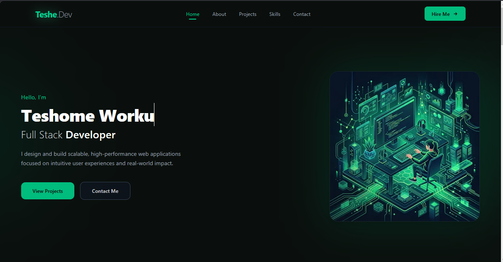
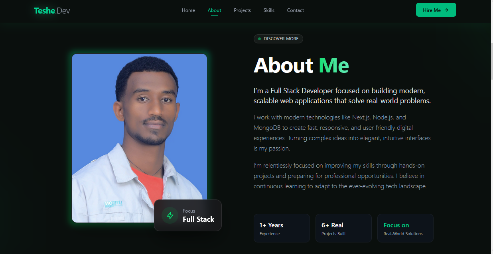
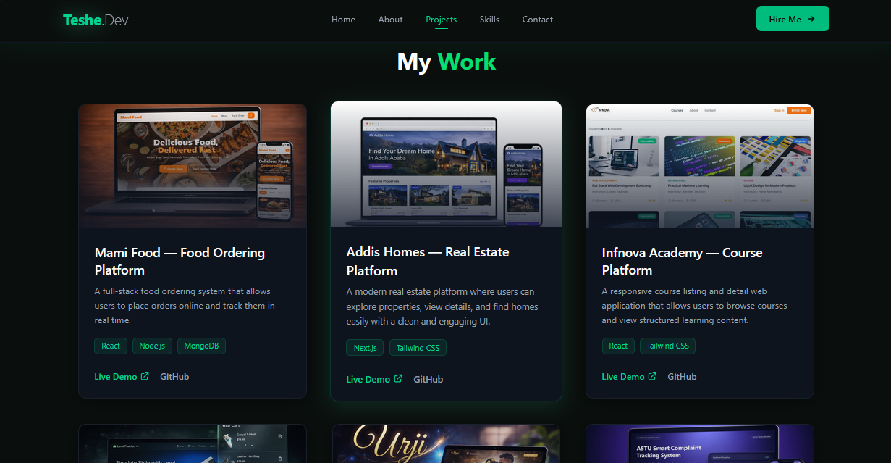
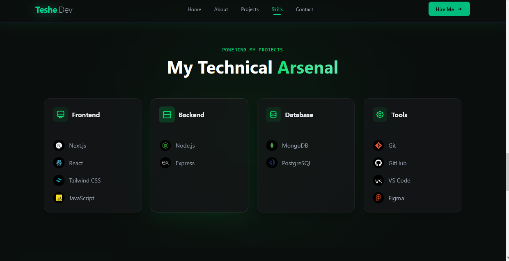
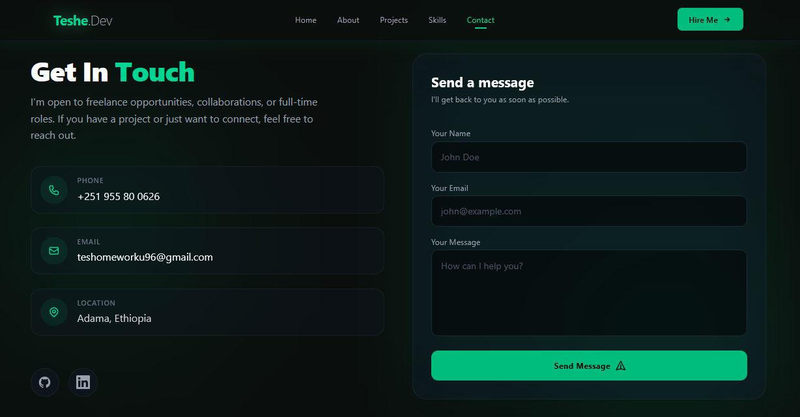

# 🌐 Personal Portfolio Website (Full Stack)

A modern, full-stack personal portfolio website built to showcase my work, skills, and projects — along with a fully functional admin dashboard to manage content and messages.

---

## 🚀 Live Demo

* 🌍 Frontend (Vercel): [live demo link](https://tesheport.vercel.app/)
* 🔗 Backend API (Render): [Live backend](https://future-fs-01-ku9l.onrender.com/)
* Admin login creds: 
    * [EMAIL_ADDRESS] / [PASSWORD]
---
    
## 📌 About The Project

This is not just a static portfolio — it is a **full-stack application** designed to represent me professionally to recruiters and clients.

It includes:

* A responsive portfolio website
* Real-time contact system
* Email notification system
* Admin dashboard for managing messages

---

## ✨ Features

### 👨‍💻 Frontend

* Modern UI built with Next.js & Tailwind CSS
* Fully responsive (mobile + desktop)
* Smooth scroll & animations
* Dark theme design

### ⚙️ Backend

* RESTful API built with Node.js & Express
* MongoDB database integration
* Secure API endpoints with JWT authentication

### 📩 Contact System

* Users can send messages via contact form
* Messages stored in MongoDB
* Email notification using Nodemailer

### 🔐 Admin Dashboard

* Secure login system (JWT-based)
* View all contact messages
* Protected routes
* Logout functionality

---

## 🛠️ Tech Stack

### Frontend

* Next.js
* Tailwind CSS

### Backend

* Node.js
* Express.js

### Database

* MongoDB (Mongoose)

### Other Tools

* Nodemailer (Email Service)
* JWT (Authentication)
* Render (Backend Deployment)
* Vercel (Frontend Deployment)

---

## 📁 Project Structure

```bash
FUTURE_INTERS/
│
├── apps/
│   ├── frontend/   # Next.js app
│   └── backend/    # Express API
│
└── README.md
```

---

## ⚙️ Setup Instructions

### 1️⃣ Clone Repository

```bash
git clone https://github.com/Teshome-Worku/FUTURE_FS_01.git
cd FUTURE_FS_01
```

---

### 2️⃣ Backend Setup

```bash
cd apps/backend
npm install
```

Create `.env` file:

```env
MONGO_URI=your_mongodb_uri
EMAIL_USER=your_email
EMAIL_PASS=your_app_password
JWT_SECRET=your_secret
ADMIN_EMAIL=admin@example.com
ADMIN_PASSWORD=your_password
```

Run backend:

```bash
node server.js
```

---

### 3️⃣ Frontend Setup

```bash
cd apps/frontend
npm install
```

Create `.env.local`:

```env
NEXT_PUBLIC_API_URL=https://future-fs-01-ku9l.onrender.com/
```

Run frontend:

```bash
npm run dev
```

---

## 🚀 Deployment

### Backend (Render)

* Root Directory: `apps/backend`
* Add environment variables in Render dashboard

### Frontend (Vercel)

* Connect GitHub repo
* Add environment variable:

```env
NEXT_PUBLIC_API_URL=https://future-fs-01-ku9l.onrender.com/
```

---

## 📸 Screenshots


* Home Section


*About Section



* Projects Section


* Skills Section


* Contact Form



* Admin Dashboard

---

## 📬 Contact

If you'd like to work with me or have any questions:

* Email: teshomeworku96@gmail.com 
* LinkedIn: https://www.linkedin.com/in/teshome-worku-017834392

---

## 💡 Final Note

This project was built as part of the **Future Interns Full Stack Development Program**, but developed with a real-world mindset — focusing on production-level structure, usability, and scalability.

---

⭐ If you like this project, feel free to star the repository!
